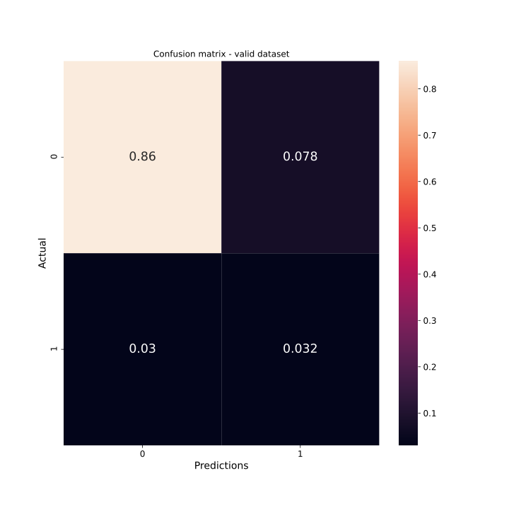

# Hyperparameter optimization
Hyperparameter optimization was performed with the help of Optuna package. The script was prepared and all the trials were saved in SQLite database in file `optuna-studyDB.db`. If you would like to perform your own optimization, you will need to create directory in current folder called `my_dictionaries` in which all runs will be stored (with tensorboard visualizations and saved models from COMPLETED trials).

# How to use?
Just simply modify [`model_optuna.py`](./model_optuna.py) with your own implementation of the NN and run script. If you also want to change learning process, then you will need to edit [`optuna_optimization.py`](./optuna_optimization.py) for your own needs.

# Metrics of the selected model after hyperparameters optimization
### Confusion matrix - train dataset

### Confusion matrix - valid dataset

### Confusion matrix - test dataset

### FN, FP, TN, TP

### Precision

### Recall

### Binary Crossentropy

### ROC

### PRC Curve

### AUC-ROC

### Binary Accuracy
