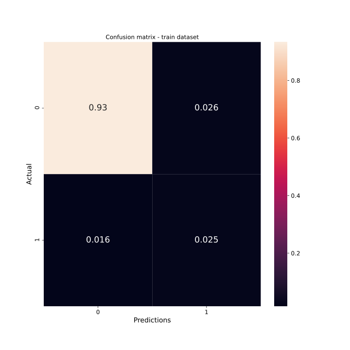
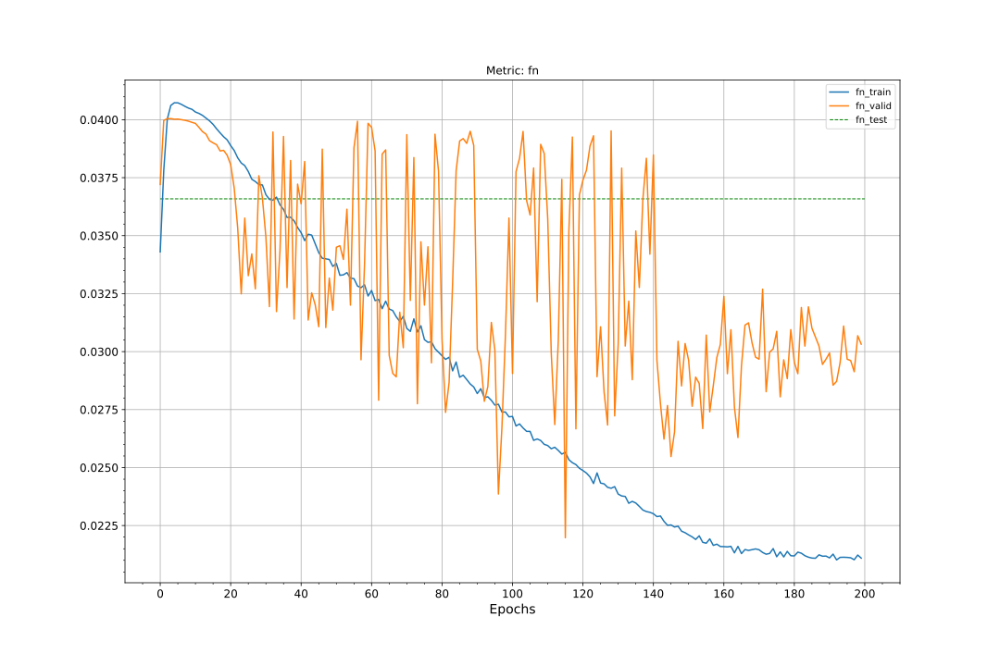
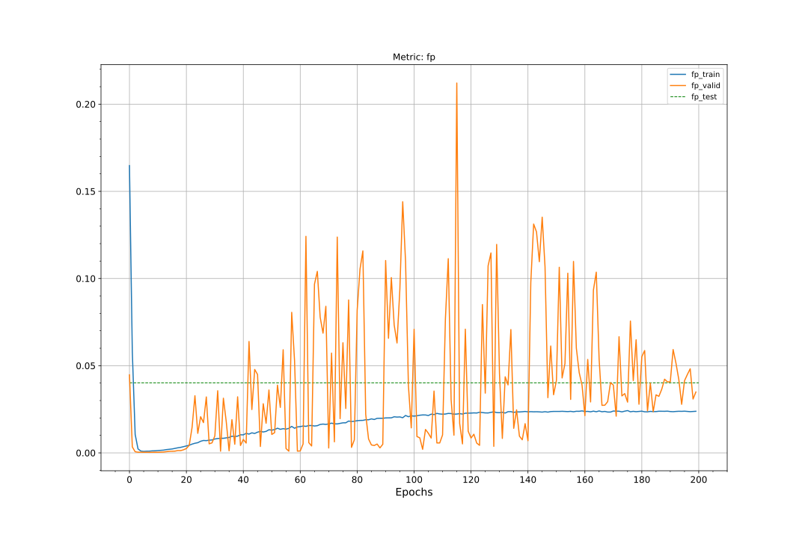
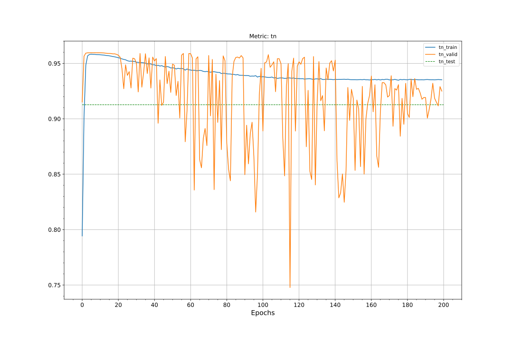
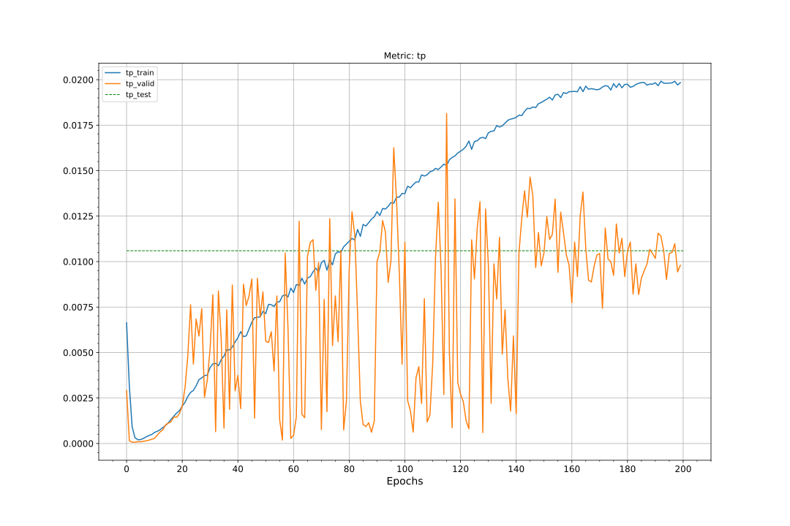
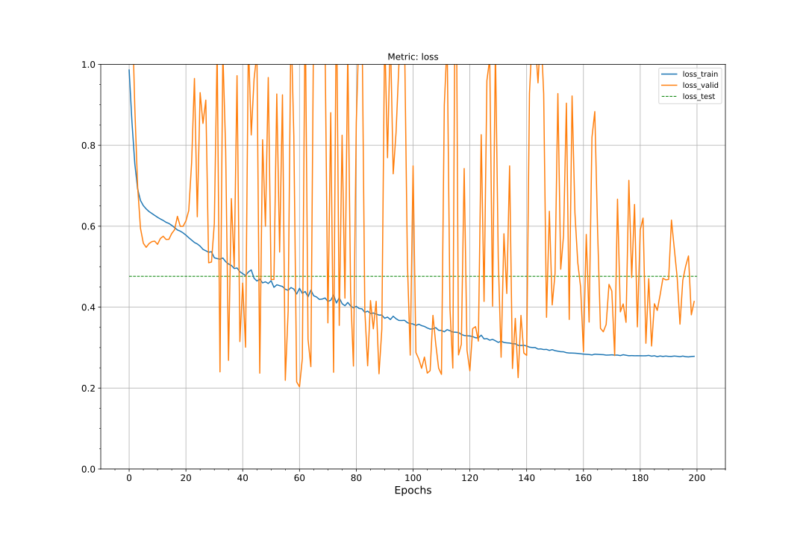
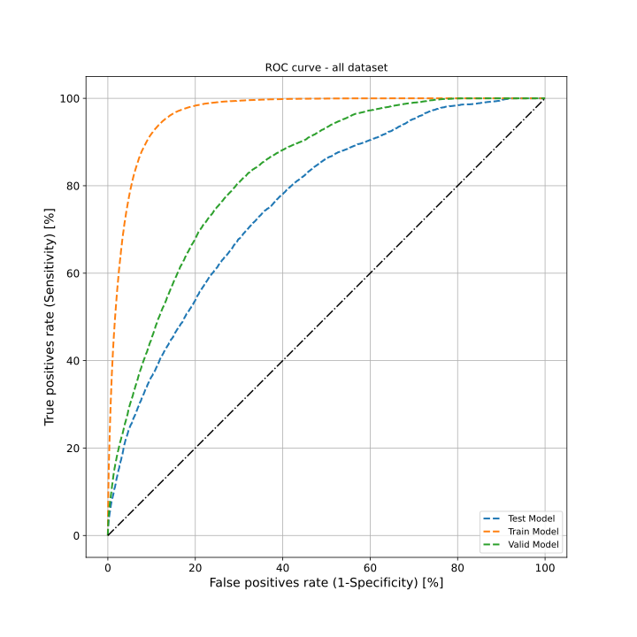
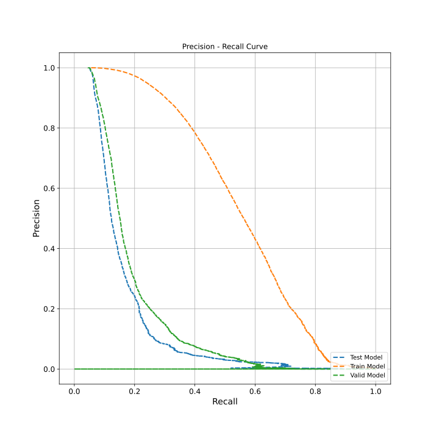
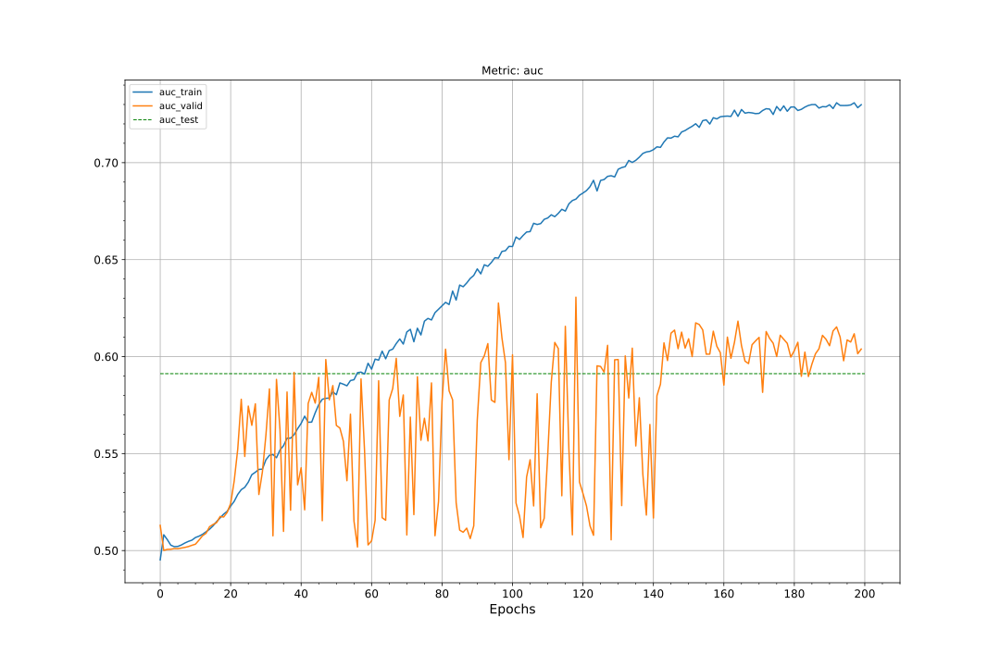
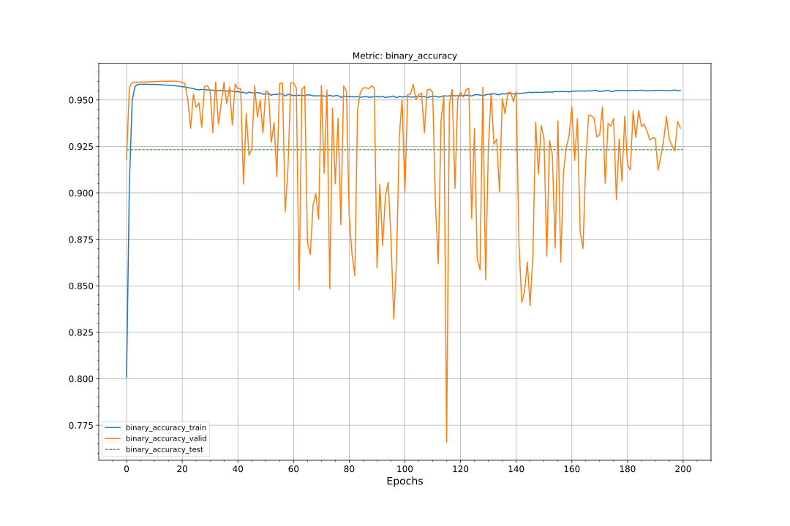

# Classification model for Cryptocurrency (BTCUSD)
In this directory you can find notebook with prepared model for Classification Model for Cryptocurrency to which I'm refering in my thesis.

# How to use?
Just simply run [`entry_model-categorical-crypto.ipynb`](./entry_model-categorical-crypto.ipynb) as you wish, you can change everything there according to your needs of discovering other model possibilities. If you want to change NN model implementation, do this in [`model_creation_categorical_crypto.py`](./model_creation_categorical_crypto.py) file. If you want to run the notebook, and have Tensorboard functionality, you will need to create first `my_dictionaries` directory in this localization, where logs from all trials you will perform, will be collected for further analysis.

# Metrics of the selected model after hyperparameters optimization
### Confusion matrix - train dataset

### Confusion matrix - valid dataset

### Confusion matrix - test dataset

### FN, FP, TN, TP

### Precision

### Recall

### Binary Crossentropy

### ROC

### PRC Curve

### AUC-ROC

### Binary Accuracy
